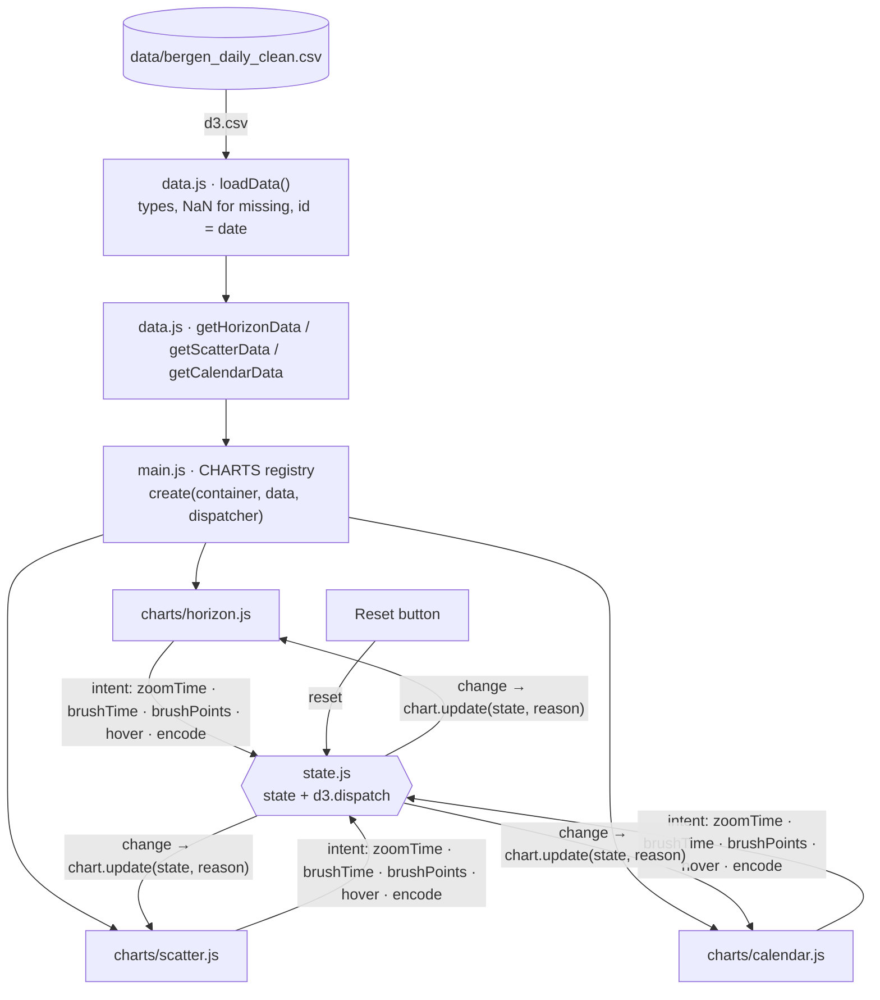

# Rain & Mobility in Bergen

Information Visualization, Group 23, Checkpoint III: first prototype.

This dashboard asks how daily rainfall in Bergen relates to city-bike use, car traffic and air quality (NO₂), for 2021–2025. It has three linked views: a horizon chart, a scatterplot and a calendar heatmap. All three use the real dataset.

## How to run

The prototype uses only D3.js v7 (a local copy in `lib/`) with plain HTML, CSS and JavaScript. It does not use npm, a build step, or the internet.

```bash
cd Information-Visualization-G23-project
python3 -m http.server 8000
```

Then open <http://localhost:8000>.

You need a local server because the browser blocks loading the CSV and the ES modules from `file://`. VS Code's *Live Server* extension also works.

## Project structure

```
index.html              page skeleton: header + 3 panels (CSS Grid)
css/style.css           ALL design tokens (colours, fonts, spacing) as :root variables
lib/d3.min.js           D3 v7.9.0, local copy
data/bergen_daily_clean.csv   dataset from CPI (1,629 days, 2021-03-04 → 2025-08-18)
js/
  main.js               entry point: loads data, mounts every chart, wires Reset/resize/expand
  data.js               loading + per-idiom preprocessing, attribute metadata
  state.js              shared state object + d3.dispatch event bus
  theme.js              reads colour tokens from CSS → d3 colour scales
  legend.js             one legend renderer for all charts
  tooltip.js            one tooltip for all charts
  expand.js             expand any panel to full screen
  charts/
    horizon.js          horizon chart
    scatter.js          scatterplot
    calendar.js         calendar heatmap
```

## Architecture



### 1. Data: `js/data.js`
`loadData()` reads the CSV once and converts the types. Empty cells become `NaN` rather than `0`, because `+""` is `0` in JavaScript and would plot days with no measurement as zero. Each row gets `id` = its ISO date.

After that, each idiom gets its own preprocessing:

| Function | Additional processing |
|---|---|
| `getHorizonData` | For 4 strips (bike trips, temperature, car traffic, NO₂):<br>1. **Aggregate: 7-day centred rolling mean.** Missing days are skipped, and a gap is left when fewer than 4 of the 7 days are measured. Each value keeps its window's first and last day for the tooltip.<br>2. **Deviation from the 2021–2025 mean**: relative (`smooth / mean − 1`, %) for trips, vehicles and µg/m³; absolute (`smooth − mean`, °C) for temperature, because a percentage of °C is meaningless.<br>3. **Band size** = max \|deviation\| / 3, rounded up (to 5 % or 1 °C). |
| `getScatterData` | One point per day. `correlation()` computes Pearson r per colour category (e.g. per season) over the days in the chosen period. |
| `getCalendarData` | Every day of 2021–2025 gets a grid position (column = Monday-first week of the year, row = weekday). Days outside the dataset get `row = null` and are drawn as **no data**, not as zero. |

### 2. Linking: `js/state.js`
The whole dashboard shares one state object:

| field | meaning |
|---|---|
| `zoom` | `[start, end]` period the dashboard is focused on (a year, or a zoomed-in brush) |
| `timeRange` | `[start, end]` period brushed in the horizon chart (inside the zoom) |
| `selectedIds` | set of selected day ids, from any chart |
| `selectionSource` | which chart made the selection |
| `hoveredId` | day under the pointer in any view |
| `encodings` | view settings: `scatter {x, y, color}`, `calendar {measure}` |

Data flows in one direction only:

1. A chart **emits an intent** through the `d3.dispatch` bus (`zoomTime`, `brushTime`, `brushPoints`, `hover`, `encode`, `reset`).
2. `state.js` updates the state and fires **`change`**.
3. Every registered chart receives `update(state, reason)` and redraws itself.

Charts never reference each other. Every idiom shows days, so the day `id` is the shared key that links them. A selection made in any view is a set of ids, and every other view can resolve those ids in its own data. `isActive(state, day)` combines the zoom, the brushed period and the day selection, so every chart applies the same rule.

### 3. Chart modules: `js/charts/*.js`
Every chart exports the same interface:

```js
create(container, data, dispatcher) → { update(state, reason), resize() }
```

### 4. Wiring: `js/main.js`
`main.js` loops over one registry:

```js
const CHARTS = [
  { id: "horizon",  module: "./charts/horizon.js",  prepare: Data.getHorizonData },
  { id: "scatter",  module: "./charts/scatter.js",  prepare: Data.getScatterData },
  { id: "calendar", module: "./charts/calendar.js", prepare: Data.getCalendarData },
];
```

For each entry it imports the module, gives it its prepared data, registers it on the dispatcher, attaches a `ResizeObserver` and adds the expand button to its panel.

**To add an idiom**, write `js/charts/<name>.js` with the standard interface and add one line to `CHARTS` (and give it a panel in the layout). Linking, resizing and full-screen mode then work for it automatically.

### 5. Visual coherence
All colours, fonts and spacing are CSS variables in `:root` (`css/style.css`). `theme.js` reads the data colours from those same variables, and `legend.js` and `tooltip.js` are shared by all charts. This means every idiom uses one palette, one font, one legend style and one tooltip style.

## The idioms

### Horizon chart: long-term trends (top)
- **Four strips**: bike trips, temperature, car traffic and NO₂. Temperature sits directly under bike trips, so Task 4 (does cycling follow the temperature cycle?) can be compared by eye.
- **Encoding:** time is on x. Each strip shows its 7-day mean as the deviation from its own 2021–2025 average, folded into 3 bands. **Hue shows the sign** (orange = above average, blue = below). The dashboard uses **no red at all**, so red and green never appear together and the colours stay readable with red–green colour blindness. **Colour intensity and height show the size**, with darker bands for bigger deviations. Next to each label, "band = …" gives what one band represents (e.g. 60 % or 5 °C).
- **Why per-series deviation ("Don't distort the truth"):** bike trips average about 1,350/day and car traffic about 40,500/day. On a shared axis bikes would be a flat line; with a dual axis any "divergence" would depend on how the two axes are scaled. The trade-off is that magnitudes are not comparable across strips, so hover gives the exact values.
- **Missing days** (traffic and NO₂ gaps) stay blank, never interpolated.
- **Interactions:**
  - **Hover** shows the date range of the 7-day window, the 7-day mean and the deviation for all four strips, and highlights that day everywhere.
  - **Drag** along the time axis to mark a period (`brushTime`). This filters the other two views, and outside the period the bands turn grey. **Zoom to period** then zooms into exactly the marked period.
  - **Year buttons** (2021–2025), or a **click on a year label** on the axis, show only that year (`zoomTime`). The whole dashboard follows. **✕ Show all years** goes back.
  - A **vertical rule** follows a day hovered in any view.
  - The **"Selected days" rug** under the strips has one tick per day selected in the scatterplot or calendar.

### Scatterplot: rain vs. mobility (bottom left)

| Decision | Why |
|---|---|
| X = rain, Y = bike trips, colour = season (default) | Correlation needs position on two axes, the most accurate channel. Season has no order, so it gets hue; four shapes on 1,629 small dots would be hard to tell apart. |
| **Switchable axes and colour** | The same view covers Task 1 (rain vs bike trips), Task 2 (colour = rain category: the legend counts the days per category), Task 3 (X = traffic, Y = bikes, colour = **year**: each year's cloud moves down and right, bikes 1,975 → 859/day while traffic 38,900 → 41,800), Task 5 (traffic vs NO₂) and Task 6 (rain or temperature vs trip duration, coloured by weekday/weekend). |
| **Correlation shown twice** | The dot pattern shows the correlation (a downward cloud = negative). The legend adds **Pearson r per colour group** plus r for all days. Rain vs bikes: r = −0.25 in summer, −0.22 in spring, −0.03 in winter. r is recomputed for the chosen period, e.g. a single year. |
| **Avoid occlusion** | 524 days (32 %) are completely dry and would stack at x = 0. Dots are small (r = 3.5) and semi-transparent, and dry days are **jittered a few pixels sideways** (a stable offset per day, so they don't jump between redraws). The axis stays linear and the tooltip shows the exact value. |
| **Daily points, not bins** | A hexbin or weekly mean would merge days, and we need single days for hover and for linking to the calendar. |
| Season: blue winter, green spring, orange summer, brown autumn; weekday blue / weekend orange; temperature blue → orange; a blue ramp for the ordinal rain category, YlGnBu light → dark for the years | Colour-blind safe; ordered attributes get an ordered lightness ramp. |
| Missing values are hidden, with a note | 21 traffic days and 33 NO₂ days have no measurement. They are left out, never drawn as zero. |

**Interactions:**
- **Dropdowns** change X, Y and colour, with a 750 ms animated transition keyed by day.
- **Hover** shows a day's values (details on demand).
- **Click a point** to select that single day everywhere; click it again to clear.
- **Brush** a rectangle to highlight those days in the other two views.
- **Click a season in the legend** to filter to that season. Every category legend shows its **day count** and **correlation r** for the chosen period.

### Calendar heatmap: individual days (bottom right)
- **Encoding:** one square per day (weeks across, weekdays down), one block per year. This respects the data topology: the yearly cycle runs across the columns and the weekly cycle down the rows. Colour intensity is less precise than position, but the task is spotting patterns, not reading exact values.
- **Colour toggle (reencoding):** **Bike trips** (Greens), **Temperature** (blue → orange), **Rain**, **Traffic** (Purples) or **Trip duration** (Oranges). Traffic shows its weekly rhythm next to the bikes' seasonal one (Task 4). Trip duration makes the weekend rows of every year darker: 11.9 vs 9.8 min (Task 6); its ramp ends at the 95th percentile, so a few 35-minute event days don't wash out the rest. Rain uses 4 ordinal steps (dry, light, moderate, heavy), and the **legend shows the number of days in each category** (Task 2). The counts follow the chosen period, e.g. 2023 alone has 41 heavy-rain days.
- **Interactions:**
  - **Days selected in other views are outlined**. They keep their colour, so you can see what the selected days look like.
  - **Click a day** to select it everywhere; **drag** across days to select a date range.
  - **Click a weekday letter** (e.g. S for Saturday) to select every such weekday.
  - **Click a year label** to show only that year (again to show all).
  - **Click a legend category** (e.g. *Heavy*) to filter the other views to those days.
  - Days outside the period marked in the horizon chart **fade out**.

### Shared UI
- **Reset** (in the header) clears all selections, filters and the zoom. View settings such as the scatterplot axes and the calendar measure are kept.
- The header shows the active period and how many days are selected.
- **Expand**: every panel has a ⤢ button in its top-right corner (double-clicking the panel title also works). It makes that chart fill the browser window, and the chart redraws at the larger size. Close it with **Esc**, the button again, or a click outside the panel.

## Which idioms answer each task

Every task is answered by at least two idioms:

| Task | Horizon | Scatterplot | Calendar |
|---|---|---|---|
| 1 Rain vs bikes, by season | – | ✓ dot pattern + r per season | ✓ select *Heavy* in rain mode, switch to Bikes: outlined days vs neighbours |
| 2 How common each rain category is | – | ✓ colour = rain category, day counts in legend | ✓ rain mode, day counts in legend |
| 3 Bikes vs traffic, 2021–2025 | ✓ bike and traffic strips | ✓ X = traffic, Y = bikes, colour = year | ~ bikes mode, lighter every year |
| 4 Bikes vs temperature cycle, and traffic | ✓ bike, temperature and traffic strips | ✓ X = temperature, Y = bikes | ✓ bikes / temperature / traffic modes |
| 5 Traffic vs NO₂ | ✓ traffic and NO₂ strips | ✓ X = traffic, Y = NO₂ | – |
| 6 Weather vs trip duration, weekday/weekend | – | ✓ Y = trip duration, colour = weekday/weekend | ✓ trip duration mode: darker weekend rows |

## Dataset

`data/bergen_daily_clean.csv` is the cleaned output from CPI: one row per day.

| Column | Unit |
|---|---|
| `date` | YYYY-MM-DD |
| `rain_mm` | mm |
| `temp_c` | °C |
| `bike_trips` | trips/day |
| `bike_avg_duration_min` | min |
| `traffic_count` | vehicles/day |
| `no2_ug_m3` | µg/m³ |
| `month`, `season`, `is_weekend`, `rain_category` | categorical |

Sources: MET Norway (weather), Bergen Bysykkel (city bikes), Statens vegvesen (traffic at Danmarks plass) and NILU (NO₂ at Danmarks plass).
